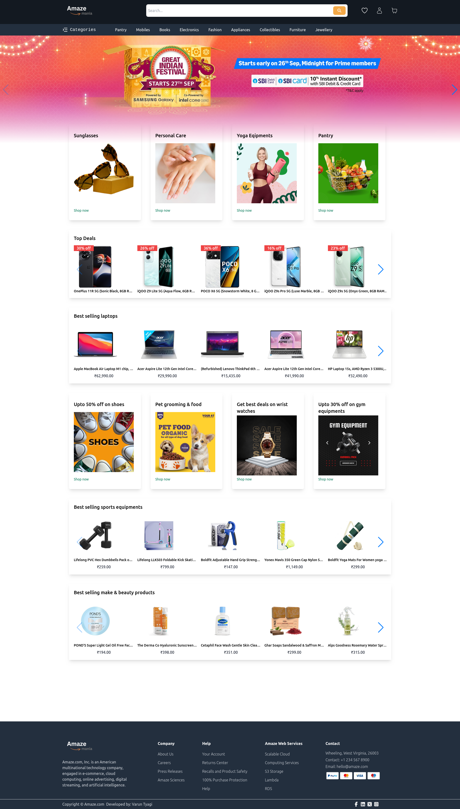
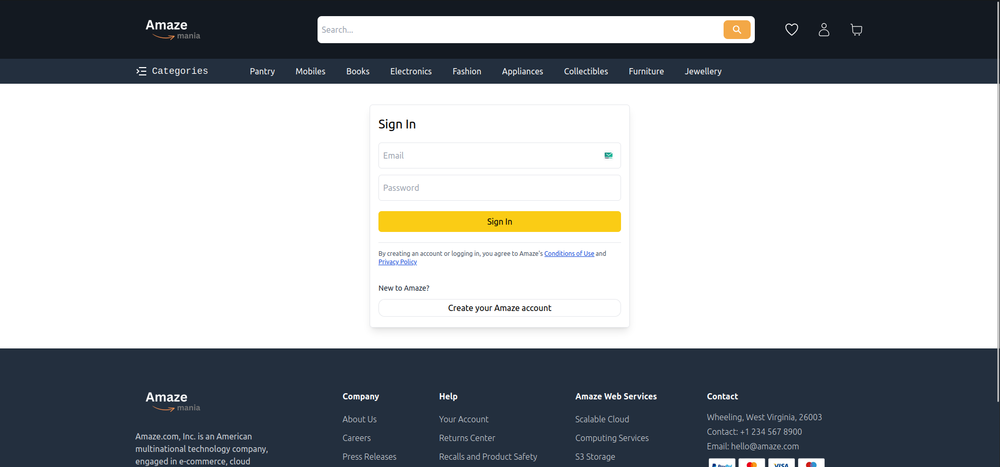
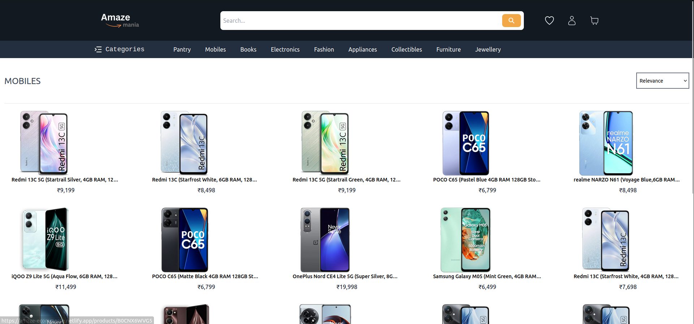
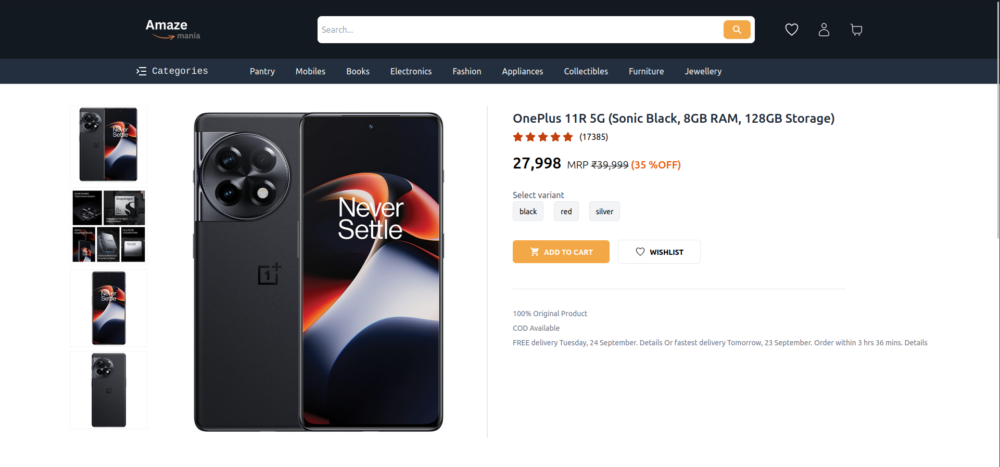

# Amazon Clone - Amaze



This project is a front-end clone of the popular e-commerce website **Amazon**. Built using **React.js**, **TailwindCSS**, and **Vite** as the build tool. The app utilizes the **real-time-amazon-data API** to fetch and display products and categories. It features add-to-cart and add-to-wishlist functionalities with toast notifications, along with state management using **Redux Toolkit**.

## Features

- **Product Listings** using **real-time-amazon-data API** for live product data.
  - Fetch and display products and categories dynamically.
- **User Authentication** with **Firebase Auth**
  - Login with email/password or mobile number and OTP.
- **Product Details Page**
  - Add to cart and add to wishlist functionality with toast notifications on actions.
- **State Management** with **Redux Toolkit**.
  - Centralized state management for cart, wishlist, and product data.
- **Responsive Design** using **TailwindCSS**.
- Fast builds and hot module replacement with **Vite**.

## Tech Stack

- **React.js** - Front-end JavaScript library for building user interfaces.
- **TailwindCSS** - A utility-first CSS framework for styling.
- **real-time-amazon-data API** - To fetch live product data.
- **Redux Toolkit** - For centralized state management.
- **Firebase Authentication** - For secure user authentication.
- **Firestore** - To store user data.
- **Toast Notifications** - To notify users of cart and wishlist actions.
- **Vite** - Build tool for fast development and optimized builds.

## Setup and Installation

1. **Clone the repository:**

   ```bash
   git clone https://github.com/vitviki/amaze.git

   ```

2. **Install dependencies:**

   ```bash
   cd myntra-clone
   npm install# React + Vite
   ```

This template provides a minimal setup to get React working in Vite with HMR and some ESLint rules.

Currently, two official plugins are available:

- [@vitejs/plugin-react](https://github.com/vitejs/vite-plugin-react/blob/main/packages/plugin-react/README.md) uses [Babel](https://babeljs.io/) for Fast Refresh
- [@vitejs/plugin-react-swc](https://github.com/vitejs/vite-plugin-react-swc) uses [SWC](https://swc.rs/) for Fast Refresh

4. **Configure Firebase:**

- Create a Firebase project at Firebase Console.
- Enable Authentication and Firestore.
- Get the Firebase config and replace it in your project (usually in a firebase.js file).

4. **Run the application using vite :**

   ```bash
   npm run dev
   ```

## Screenshots

- Login



- Products Page



- Product details Page


